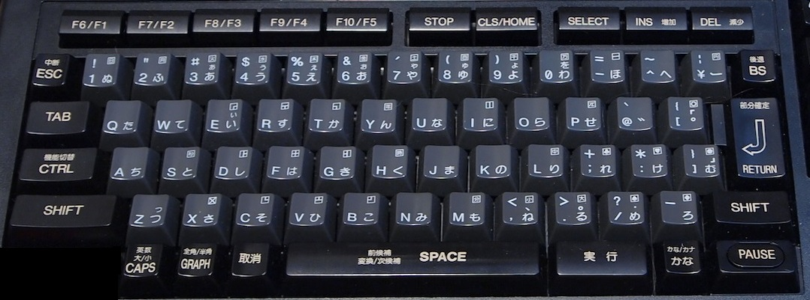

fmsx
====

This is a port of Marat Fayzullin's fMSX 6.0 (21-Feb-2021) to the libretro API.

Source : http://fms.komkon.org/fMSX/


## Recognized file extensions
* .rom .mx1 .mx2 .ROM .MX1 .MX2 - for ROM images
* .dsk .DSK .fdi .FDI - for FAT12 360/720kB disk images
* .cas .CAS - for fMSX tape files
* .m3u .M3U - for multidisk software

The supplied location must exist and must be a readable file with one of the listed extensions. 
If, e.g., it points to a directory or non-existent file, 
no image is loaded and this core will boot into MSX-BASIC. It is not possible to insert a disk into a running core.


## Saving state
Some state is automatically persisted to these files at shutdown:
- [RTC](https://www.msx.org/wiki/Ricoh_RP-5C01) (real time clock, screen settings, etc.): to `CMOS.ROM` (system directory, 52B)
- **SRAM** in **ASCII8** & **ASCII16** mapper ROMs: to `<Game>.sav` (working directory, 8 or 2KiB)
- **FM-PAC SRAM**: to `FMPAC.sav` (working directory, 8KiB)
- **Konami Game Master 2 SRAM**: to `GMASTER2.sav` (working directory, 8KiB)

These files will only be created when the RTC resp. SRAM data is actually changed during gameplay.

SRAM only applies when the respective support ROM (FMPAC, GMASTER2) is loaded, and when the selected content 
supports that type of SRAM. Consult a game's manual to verify if SRAM saving is supported, and if so, what type.
The `FMPAC.ROM` and/or `GMASTER2.ROM` must be present in the RetroArch system directory and are to be provided by the user.

Many disk-based games, especially multi-disk games, support saving to disk.
To persist disk saves, set option "Save disk changes" (`fmsx_flush_disk`) to "Immediate" or "On close".

Alternatively, set option "Save disk changes" (`fmsx_flush_disk`) to "To/From SRAM". 
This will leave your content files intact and save updated disk data into RetroArch SRAM file `<Game>.srm`
in the configured `savefile_directory` when exiting RetroArch or unloading the content.
For multidisk, only changed disks (usually your User Disk) will be persisted into SRAM. 

Note: this usage of RetroArch SRAM has nothing to do with MSX SRAM.
This core currently does _not_ support saving MSX game SRAM into RetroArch SRAM `<Game>.srm` files, 
nor saving RTC data into RetroArch RTC `<Game>.rtc`.

If persisting whole disks to RetroArch SRAM is not preferred, opt instead for persisting state; 
by default Save State button is F2 and Load State is F4.
RetroArch will save state (compressed) to `<Game>.state` in the configured `savestate_directory`.

For the state to be properly restored after a restart, this core must be started with **exactly** the same settings 
(MSX type, RAM size, etc.) & loaded files (ROMs, DSKs, CMOS, SRAM, etc).


## Tape (cassette) software
Tapes are automatically started based on their detected type (binary, ASCII or BASIC).

Press F6 to rewind the tape, if that's needed.


## Multidisk software
Create a textfile with extension `.m3u` and list one `.dsk` filename per line.
The file will be resolved relative to the directory location of the `.m3u`-file.
Absolute files are also supported; start the full path with `<drive>:` on Windows or `/` on other OSes.

Navigate through the disk images using RetroArch hotkeys; configure these settings:

    # keyboard settings
    input_disk_eject_toggle = ".."
    input_disk_prev = ".."
    input_disk_next = ".."
and/or

    # RetroPad settings
    input_disk_eject_toggle_btn = ".."
    input_disk_prev_btn = ".."
    input_disk_next_btn = ".."

Note: 
* these hotkeys are by default _unmapped_ in RetroArch
* images can only be swapped in the 'eject' state


## Creating empty disk images
An MSX computer will boot into an MSX-BASIC prompt when no cartridge or executable disk is inserted.
By default, attempts to do disk I/O will then result in 'Disk offline' errors.

To create an empty disk image, which can be written to from MSX-BASIC, set both of these options:
* "Create empty disk image when none loaded": Yes (option `fmsx_phantom_disk`)
* "Save changes to .dsk": Immediate or On close (option `fmsx_flush_disk`)
Without the latter setting, changes to the created disk will be lost.

This option can also be used to create User Disks for multi-disk games.

The following situations can arise:
* _no content selected when starting core_: changes will be lost; no filename is known
* _non-existent .cas, .rom, .m3u or .fdi selected_: changes will be lost
* _non-existent .dsk image selected_: .dsk image created on host filesystem
* _non-existent file listed in .m3u_: .dsk image created on host filesystem
* _RGUI > Quick Menu > Disk Control > Disk Image Append_: RGUI enforces an _existing_ file to be chosen.
  However, this can, e.g., be a zero-byte file. 
  As long as it has a .dsk file extension, a valid .dsk image file will be created & saved.


## Cheats
"To make cheat codes for `Game.rom`, create `Game.cht` containing codes in `00AAAAAA-DD` and `00AAAAAA-DDDD` formats, one per line. 
Where `AAAAAA` is the ROM address and `DD` is the value to write there. For 16bit values, use `DDDD`.
The cheat file will be loaded automatically." ([fMSX site](https://fms.komkon.org/fMSX/fMSX.html#LABB), section "New in fMSX 4.0")
Press F7 to activate cheats; press F7 again to deactivate. 

Note: this .cht format is specific to fMSX and differs from [RetroArch's CHT files](https://github.com/libretro/libretro-database/blob/master/cht/Microsoft%20-%20MSX%20-%20MSX2%20-%20MSX2P%20-%20MSX%20Turbo%20R/)!
This core does not (yet) support [RetroArch cheat codes](https://docs.libretro.com/guides/cheat-codes/).
Neither Emulator Handled (lr-db for MSX does not even contain any that would apply; no `code` values) 
nor RetroArch Handled (would probably require support for loading content from memory and/or memory mapping).

A BlueMSX MCF named `Game.mcf` will also be loaded automatically. Press F7 repeatedly to active cheats one by one, or disable cheats.  


## Cheevos / RetroAchievements
This core supports [RetroAchievements](https://retroachievements.org).

There are currently [16 MSX games with achievements](https://retroachievements.org/gameList.php?c=29).
Most are verified to work in this core. Note: this list is just for reference; will not be updated.

Take note of the following to ensure your achievements are registered:

- Use a recent version of your preferred frontend, e.g., RetroArch
- [follow the (libretro) howto](https://docs.libretro.com/guides/retroachievements/#how-to-setup-achievements)
- ❗ [make sure the content you start has the exact same hash](https://docs.retroachievements.org/Game-Identification/#msx) (MD5, SHA1, CRC32) as listed below
- ❗ Content marked with * below requires the [CARTS.SHA](https://raw.githubusercontent.com/libretro/fmsx-libretro/master/fMSX/ROMs/CARTS.SHA) file as distributed with fMSX to be present in the RetroArch system folder
- if these tips don't help, see the [RetroAchievements FAQ](https://docs.retroachievements.org/My-game-is-not-loading-achievements/)

Game-specific remarks:
- **SD-Snatcher** is only registered at RetroAchievements for the **Melancholia English translation**. There are [instructions for applying that patch](https://www.mediafire.com/file/4kzsfn2p22laxsv), 
and creating a four-disk .m3u (multi-disk) including the user save disk. The intermediate files with hashes are listed for convenience.
❗ Although saving to disk will immediately break the hash, this _only_ applies to *game* disks.
To save progress in SD-Snatcher, you'll have to set `fmsx_flush_disk` to 'Immediate' or 'On close' to enable writing to the fourth (User) disk.
This user disk is not part of the set of hashes that RetroAchievements verifies.
- **Penguin-Kun Wars 2**: the English translation is not listed in CARTS.SHA. Manually set `fmsx_mapper_type_mode` to 'ASCII 16kB'.
- **Metal Gear**: RetroAchievements operates with MD5 hashes. Since the openMSX database and fMSX CARTS.SHA use SHA1 hashes, those are listed here where available. 
  When running a patched ROM with _unlisted_ SHA1, manually set `fmsx_mapper_type_mode` to 'Konami4 8kB'.  
- **Metal Gear 2**: same, but set 'Konami5 8kB'

|Game|RA topic & gen-MSX|Verified lr-fmsx|Common filename|Type|Platform|MD5|SHA1|CRC32|Remarks|
|---|---|---|---|---|---|---|---|---|---|
|[Aleste](https://retroachievements.org/game/7578)|[Topic](https://retroachievements.org/viewtopic.php?t=12082) [GenMSX](https://www.generation-msx.nl/software/compile/aleste/release/1055/)|✓ *|Aleste (Japan).rom|ROM|MSX2|7087b51f3ccfdf314ce60d5d8aaf644a|12f6f31f495bfb384c9ca9067bfbf8f98af6adf9|
| | |✓|Aleste (Japan).dsk|Disk| |28427cfe955f65c6ec8ef2bdd35ff6a7|655989b36f291d7ad2e8a1bb7711ec32287363c8| 
| | | |alesteen.dsk|Disk| |2ebb5484e112b0c41fa0d392da9a9bf1| | |English Patch|
|[Knightmare](https://retroachievements.org/game/10507)|[Topic](https://retroachievements.org/viewtopic.php?t=13660) [GenMSX](https://www.generation-msx.nl/software/konami/knightmare/release/855/)|✓|Knightmare - Majou Densetsu (Japan).rom|ROM|MSX1|ebfcaba358d7ceca95c7385276321f78|c8ff858d239c62a859f15c2f1bf44e1d657cec13|0DB84205|
|[SD-Snatcher (Melancholia English Translation)](https://retroachievements.org/game/10505)|[Topic](https://retroachievements.org/viewtopic.php?t=13309) [GenMSX](https://www.generation-msx.nl/software/konami/sd-snatcher/release/1267/)|n/a|Super Deform Snatcher (1990)(Konami)(ja)(Disk 1 of 3)\[a]\[SCC+].dsk|original|MSX2 SCC+| |4cef12ae13334ed4f3f890311b641c1ad2bdc408|74DF1878|filename variant 1|
| | |n/a|Super Deform Snatcher (1990)(Konami)(ja)(Disk 2 of 3)\[SCC+].dsk|original| | |1156f6c4d9332fdc6cda05558ac3e3102a2764fe|930E06B3|
| | |n/a|Super Deform Snatcher (1990)(Konami)(ja)(Disk 3 of 3)\[SCC+].dsk|original| | |e4b1b5f8b7ea4532551c103164860c8802151131|0547BB3A|
| | |n/a|SD Snatcher Japanese for SCC+ Disk 1.DSK|original| | | |74DF1878|filename variant 2|
| | |n/a|SD Snatcher Japanese for SCC+ Disk 2.DSK|original| | | |930E06B3|
| | |n/a|SD Snatcher Japanese for SCC+ Disk 3.DSK|original| | | |0547BB3A|
| | |n/a|SD092M1E.IPS|Patch| | |9f09878023f0ce424cc3200e9ad6870c9d3325a2|F5A3D165|
| | |n/a|SD092M2E.IPS|Patch| | |7eeab38f97064aaa0158826dbb181126b9344a87|FD1B05CE|
| | |n/a|SD092M3E.IPS|Patch| | |45f5c4db226fc177b3e797cc3a7d95b61c10ebee|D30D8D7E|
| | |✓|SD Snatcher (Melancholia Translation - Any SCC Cartridge) Disk 1.dsk|Multi-Disk| |3bcf74b40f15eef5aab22a49781f9f1a|9d12c20f71c4049f8a8b65cc4f13fd7b54affadc|1B3D3C89|
| | |✓|SD Snatcher (Melancholia Translation - Any SCC Cartridge) Disk 2.dsk|Multi-Disk| |6d1990d36783caf8b6e4d73ae22c98b1|4983041e918acd599e65c70de3101011c43b059a|AC407E31|
| | |✓|SD Snatcher (Melancholia Translation - Any SCC Cartridge) Disk 3.dsk|Multi-Disk| |e4d3e483964c62ade5f07afdd81dd64b|0c4c993758e69a8f8fd79fbc4eef4cecdc156f32|F626F02E|
|[Metal Gear](https://retroachievements.org/game/10501)|[Topic](https://retroachievements.org/viewtopic.php?t=10641) [GenMSX](https://www.generation-msx.nl/software/konami/metal-gear/release/1028/)|✓ *|Metal Gear (J).mx2|ROM|MSX2|12e302954fa9b23c11ce7c8f5770b82a|a52021f1b257c7c35d626d5d642134091c45e4f4|
| | | |Metal Gear \[RC-750](JP).rom|ROM| |439ea985617135d70858f0e6f88ba0f9|
| | | |Metal Gear (T-Eng).mx2|ROM| |56a32f310765e54101a10001d28344b6| | |Nekura_Heko Patch - version 1995c (English translation)|
| | | |Metal Gear \[RC-750](T-Eng).rom|ROM| |3da994910180808cc03bbe3df973b55c|
| | | |Metal Gear (T-Eng).mx2|ROM| |6e5144f5c8e50fb2f8f00852cbf3d2ca| | |TyrannoRanger/Mr. Dude Patch - version 1.0 (English translation)|
| | | |Metal Gear \[RC-750](T-Eng).rom|ROM| |8473c150867394a0f0de6e8d29c9a50a|
|[Metal Gear 2: Solid Snake](https://retroachievements.org/game/10504)|[Topic](https://retroachievements.org/viewtopic.php?t=10642) [GenMSX](https://www.generation-msx.nl/software/konami/metal-gear-2---solid-snake/release/1248/)|✓ *|Metal Gear 2 - Solid Snake (J).mx2|ROM|MSX2 SCC|9f50d92d35e19d5de37d75a36a410588|af567ea6e27912d6d5bf1c8e9bc18e9b393fd1ab|
| | | |Metal Gear 2 - Solid Snake (J) \[Turbo Fix].mx2|ROM| |72e813494dcacde3029a07db1ecca934|
| | |✓ *|Metal Gear 2 - Solid Snake \[T-Eng].mx2|ROM| |668217f475619500c87f136949267b6d|a7b196f7e934faa76602c8c00bd2f6e6d2d70787| |English|
| | | |Metal Gear 2 - Solid Snake \[T-Eng+Turbo Fix].mx2|ROM| |8fe72857b748852cec910345ce7a2b73| | |English|
| | | |Metal Gear 2 - Solid Snake \[T-Eng+Addendum].mx2|ROM| |c54d3657e78b1ecc7cfe4f641158fbff| | |English|
| | | |Metal Gear 2 - Solid Snake \[T-Eng+Addendum+Turbo Fix].mx2|ROM| |a501ffaf9fb30c3a68c0c4c803fba341| | |English|
| | | |Metal Gear 2 - Solid Snake \[Addendum Only].mx2|ROM| |01ec86d19248514baf263f0b60df4d0c| | |English|
| | | |Metal Gear 2 - Solid Snake \[Addendum Only+Turbo Fix].mx2|ROM| |da8047597419d24897d8a43c0056876e| | |English|
| | | |Metal Gear 2 - Solid Snake \[T-Por].mx2|ROM| |614c03a00bfee70c581f759e96cdc099| | |Portuguese|
| | | |Metal Gear 2 - Solid Snake \[T-Por+Turbo Fix].mx2|ROM| |70e3d3dd66a97aeef6a87db23fadfc32| | |Portuguese|
|[Oh Shit!](https://retroachievements.org/game/17069)|[Topic](https://retroachievements.org/viewtopic.php?t=11765) [GenMSX](https://www.generation-msx.nl/software/aackosoft/oh-shit/release/2400/)|?|Oh_Shit.rom|ROM|MSX1|1721862f3f033e74607af9e26688403d| |1d34e4e0|
|[Picture Puzzle (HAL Laboratory, 1983)](https://retroachievements.org/game/16396)|[Topic](https://retroachievements.org/viewtopic.php?t=11976) [GenMSX](https://www.generation-msx.nl/software/hal-laboratory/picture-puzzle/release/60/)|✓|Picture Puzzle (Japan).rom|ROM|MSX1 |9383ba8643fd1000b5cc099cf9d46822|336a7c451a03c9a55726d171603b54628ad832c8|
| | | |Picture Puzzle (Japan) (Alt 1).rom|ROM| |ac0bc988775b9c65c92cfb200f9b1beb| |
|[Picture Puzzle (Karoshi Corporation, 2004)](https://retroachievements.org/game/16395)|[Topic](https://retroachievements.org/viewtopic.php?t=11007) [GenMSX](https://www.generation-msx.nl/software/karoshi/picture-puzzle/release/3680/)|✓|Picture Puzzle v2 (2004)(Karoshi)\[RK706].rom|ROM|MSX1|6ee570b6fa73fe9a147846078cddc11c|27e56fbec7fa39ce19d045b0dbc4217d290f92e2|
|[Sudoku](https://retroachievements.org/game/16506) MSXdev '06|[Topic](https://retroachievements.org/viewtopic.php?t=11313) [GenMSX](https://www.generation-msx.nl/software/dvik-joyrex/sudoku/release/3715/)|✓|sudoku.rom|ROM|MSX1|2df142939c9e1147f814099856fd6361|120d477cd28b48b8a63efb34920ac331b54e66e5|
|[The Treasure of Usas](https://retroachievements.org/game/17872)|[Topic](https://retroachievements.org/viewtopic.php?t=13620) [GenMSX](https://www.generation-msx.nl/software/konami/usas/release/895/)|✓ *|Treasure of Usas, The (Japan, Europe).rom|ROM|MSX2|9aab75984b06c21ed8e6214474d3a68e|4ff2aad8371e382e203c7f29b665612a8c9d937c|30396650|
|[Vampire Killer](https://retroachievements.org/game/3289)|[Topic](https://retroachievements.org/viewtopic.php?t=11050) [GenMSX](https://www.generation-msx.nl/software/konami/vampire-killer/release/696/)|✓ *|Vampire Killer (Japan, Europe).rom|ROM|MSX2|92ba9dab3c7a4ac6c8a130f6ccbac91c|5ef7d03b138a2023f6def241b671c666f97ed83b|5953D084|
|[~Homebrew~ ~Prototype~ Super Mario World](https://retroachievements.org/game/17024)|[Topic](https://retroachievements.org/viewtopic.php?t=11658) [MSX games world](https://msxgamesworld.com/software.php?id=4519)|✓|Super Mario World - Daemos et al. (2016)\[Advanced Prototype]\[original] \[3392].rom|ROM|MSX2(+)|da28da0bb524bd0072e10b2799a88a75|77b37d7028d5f657239eb24f0c16097a6e183f8d|9d90c0a6|
|[Mappy](https://retroachievements.org/game/17324)|[Topic](https://retroachievements.org/viewtopic.php?t=12058) [GenMSX](https://www.generation-msx.nl/software/namco/mappy/release/329/)|✓|Mappy (Japan).rom / Mappy (1984) (Namcot) (J).rom|ROM|MSX1|134f8a060bb879a343afcae975e45adf|e7d06c0a5c7f256c061e5b8173fdcc145d2fc4d6|
| | |✓|Mappy (Japan) (Alt 1).rom|ROM| |1c8f344249b311b13ad4bade12ca49d3|a8313b0dce35faa80b399a220f19b04333fdec1d|
| | | |Mappy (Japan) (Alt 2).rom|ROM| |ac32e186da2c5cedc5abbdcabe7575ff| |
|[Penguin-kun Wars 2](https://retroachievements.org/game/10472)|[Topic](https://retroachievements.org/viewtopic.php?t=13795) [GenMSX](https://www.generation-msx.nl/software/ascii-corporation/penguin-kun-wars-2/release/1211/)|✓ *|Penguin-kun Wars 2 (Japan).rom|ROM| |3db77573e81184156486fe743b828e58|b7104477c8801fe54d1ba91f3a77ac6e4f399f52|
| | |✓❗|Penguin-kun Wars 2 (Japan) + [English Patch](https://www.romhacking.net/translations/1463/) .rom|ROM|MSX2|d4f8d8a7e052a0d6246ac2b5afdc729e|9f476f544d1cd5f87d4ca19665ccdbf6ac0f68a0|
|[Zoom 909](https://retroachievements.org/game/16530)|[Topic](https://retroachievements.org/viewtopic.php?t=11248) [GenMSX](https://www.generation-msx.nl/software/sega/zoom-909/release/521/)|✓|Zoom 909 (Japan).rom|ROM|MSX1|d8e09f622af52e07a83f19ca58aee194|07db3e3ffb16c138f9da12cacde48bf7522a188c|64283863|
|[Space Manbow](https://retroachievements.org/game/4023)|[Topic](https://retroachievements.org/viewtopic.php?t=13687) [GenMSX](https://www.generation-msx.nl/software/konami/space-manbow/release/1238/)|✓ *|Space Manbow (1989) (Konami) (J)|ROM|MSX2(+) SCC|f78b9f4ea885cf072e5b41dce9f15436|f6199f48ff994fc9a8e33a8581bb3bb16dd301ab|


## Configuration options
Specify these in your RetroArch core options, either manually or via the RetroArch GUI.

A restart is required after changing most of these options.  

| setting                                                                                                                            | meaning                                                                                    | choices<br>(*) indicates the default setting                                                                                                                                                                                                                                                                                                                                                                                                                                                                                                                                 |
|------------------------------------------------------------------------------------------------------------------------------------|--------------------------------------------------------------------------------------------|------------------------------------------------------------------------------------------------------------------------------------------------------------------------------------------------------------------------------------------------------------------------------------------------------------------------------------------------------------------------------------------------------------------------------------------------------------------------------------------------------------------------------------------------------------------------------|
| `fmsx_mode`                                                                                                                        | MSX model                                                                                  | MSX2+*&vert;MSX1&vert;MSX2                                                                                                                                                                                                                                                                                                                                                                                                                                                                                                                                                   |
| `fmsx_video_mode`                                                                                                                  | select 60Hz or 50Hz                                                                        | NTSC*&vert;PAL&vert;Dynamic                                                                                                                                                                                                                                                                                                                                                                                                                                                                                                                                                  |
| `fmsx_hires`                                                                                                                       | Support high resolution                                                                    | Off*&vert;Interlaced&vert;Progressive                                                                                                                                                                                                                                                                                                                                                                                                                                                                                                                                        |
| `fmsx_overscan`                                                                                                                    | Support overscan                                                                           | *No&vert;Yes                                                                                                                                                                                                                                                                                                                                                                                                                                                                                                                                                                 |
| `fmsx_mapper_type_mode`                                                                                                            | ROM mapper - use if a ROM does not load                                                    | Guess*&vert;Generic 8kB&vert;Generic 16kB&vert;Konami5 8kB&vert;Konami4 8kB&vert;ASCII 8kB&vert;ASCII 16kB&vert;GameMaster2&vert;FMPAC                                                                                                                                                                                                                                                                                                                                                                                                                                       |
| `fmsx_ram_pages`                                                                                                                   | RAM size                                                                                   | Auto*&vert;64KB&vert;128KB&vert;256KB&vert;512KB&vert;4MB                                                                                                                                                                                                                                                                                                                                                                                                                                                                                                                    |
| `fmsx_vram_pages`                                                                                                                  | Video-RAM size                                                                             | Auto*&vert;32KB&vert;64KB&vert;128KB&vert;192KB                                                                                                                                                                                                                                                                                                                                                                                                                                                                                                                              |
| `fmsx_scci_megaram`                                                                                                                | Enable SCC-I 128kB MegaRAM                                                                 | Yes*&vert;No                                                                                                                                                                                                                                                                                                                                                                                                                                                                                                                                                                 |
| `fmsx_ym2413_core`                                                                                                                 | YM2413 (FM-PAC / MSX-MUSIC) core                                                           | fMSX*&vert;NukeYKT (no restart required)                                                                                                                                                                                                                                                                                                                                                                                                                                                                                                                                     |
| `fmsx_load_game_master`                                                                                                            | Load GMASTER(2).ROM when present (will start Game Master before the game)                  | No*&vert;Yes                                                                                                                                                                                                                                                                                                                                                                                                                                                                                                                                                                 |
| `fmsx_simbdos`                                                                                                                     | Simulate BDOS DiskROM access calls (faster, but does not support CALL FORMAT)              | No*&vert;Yes                                                                                                                                                                                                                                                                                                                                                                                                                                                                                                                                                                 |
| `fmsx_dos2`                                                                                                                        | Load MSXDOS2.ROM when found                                                                | No*&vert;Yes                                                                                                                                                                                                                                                                                                                                                                                                                                                                                                                                                                 |
| `fmsx_autospace`                                                                                                                   | Autofire the spacebar                                                                      | No*&vert;Yes                                                                                                                                                                                                                                                                                                                                                                                                                                                                                                                                                                 |
| `fmsx_allsprites`                                                                                                                  | Show all sprites - do not emulate VDP hardware limitation                                  | No*&vert;Yes                                                                                                                                                                                                                                                                                                                                                                                                                                                                                                                                                                 |
| `fmsx_font`                                                                                                                        | load a fixed text font from  RetroArch's `system_directory`                                | standard*&vert;DEFAULT.FNT&vert;ITALIC.FNT&vert;INTERNAT.FNT&vert;CYRILLIC.FNT&vert;KOREAN.FNT&vert;JAPANESE.FNT                                                                                                                                                                                                                                                                                                                                                                                                                                                             |
| `fmsx_flush_disk`                                                                                                                  | Save changes to .dsk image or SRAM                                                         | Never*&vert;Immediate&vert;On close&vert;To/From SRAM                                                                                                                                                                                                                                                                                                                                                                                                                                                                                                                        |
| `fmsx_phantom_disk`                                                                                                                | Create empty disk image when none loaded                                                   | No*&vert;Yes                                                                                                                                                                                                                                                                                                                                                                                                                                                                                                                                                                 |
| `fmsx_custom_keyboard_XXX`<br>where XXX is `up`,`down`,`left`,`right`,`a`,`b`,`y`,`x`,`start`,`select`,`l`,`r`,`l2`,`r2`,`l3`,`r3` | For User 1 Device Type 'Custom Keyboard', map RetroPad button to selected MSX keyboard key | left&vert;up&vert;right&vert;down&vert;<br>shift&vert;ctrl&vert;graph&vert;<br>backspace&vert;tab&vert;escape&vert;space&vert;capslock&vert;select&vert;home&vert;enter&vert;del&vert;insert&vert;country&vert;dead&vert;stop&vert;<br>f1&vert;f2&vert;f3&vert;f4&vert;f5&vert;<br>keypad0~9&vert;kp_multiply&vert;kp_plus&vert;kp_divide&vert;kp_minus&vert;kp_comma&vert;kp_period&vert;<br>backquote&vert;minus&vert;equals&vert;leftbracket&vert;rightbracket&vert;backslash&vert;semicolon&vert;quote&vert;comma&vert;period&vert;slash&vert;<br>0-9&vert;a-z&vert;<br> |
| `fmsx_log_level`                                                                                                                   | Configure the amount of fMSX logging                                                       | Off*&vert;Info&vert;Debug&vert;Spam                                                                                                                                                                                                                                                                                                                                                                                                                                                                                                                                          |


## PAL vs. NTSC
Selecting `fmsx_video_mode` 'PAL' or 'NTSC', as stated in the fMSX manual, will _"set PAL/NTSC HBlank/VBlank periods"_ at startup.
Also, the RetroArch framerate will be set to 50 resp. 60Hz. The RetroArch region is synchronized with the framerate.

However, those two settings do not take into account the internal VDP (Video Display Processor) behaviour related to 
the maximum number of scanlines and the line coincidence threshold. Also, some games may request to switch the mode.

To synchronize that, select 'Dynamic'. Models MSX1 and MSX2+ will then start up at 60Hz and adapt when a game switches to 50Hz.
MSX2 by default starts up at 50Hz and likewise will switch to 60Hz.

In 'Dynamic' mode, press F8 to toggle between 50/PAL and 60/NTSC.

When switching modes, a notification will be shown.

The displayed number of scanlines (192 or 212) remains the same for PAL or NTSC. 

## BIOS
BIOS ROMs are loaded from RetroArch's `system_directory`. The screen will remain black if required ROMs are missing.

These BIOS ROMs are required for execution:
* MSX1: MSX.ROM
* MSX2: MSX2.ROM, MSX2EXT.ROM
* MSX2+: MSX2P.ROM, MSX2PEXT.ROM

Optional; loaded when found:
* DISK.ROM - required to be able to run .dsk and .m3u images. 
  A notification will be shown for 10s when loading such an image without a proper DISK.ROM in place.
* FMPAC.ROM
* KANJI.ROM
* MSXDOS2.ROM (MSX2/2+) - requires DISK.ROM too. When present, activates Disk BASIC 2.01.
* PAINTER.ROM (MSX2/2+) - press space during boot to start
* RS232.ROM - although serial COM I/O is removed in this core
* CMOS.ROM - not a real ROM; a dump of the RTC contents (Real Time Clock; 52 Bytes)
* [GMASTER2.ROM](https://www.generation-msx.nl/group/games-with-game-master-2-s-ram-support/25/), 
  [GMASTER.ROM](https://www.generation-msx.nl/group/games-with-game-master-support/26/) - Konami's Game Master 2 & 1 (only one ROM is loaded; GM2 attempted first)


## Mapping of controls
User 1:

* "Joystick": map RetroPad to MSX joystick A

| RetroPad | MSX         |
|----------|-------------|
| LEFT     | Stick Left  |
| UP       | Stick Up    |
| DOWN     | Stick Down  |
| RIGHT    | Stick Right |
| A        | Fire A      |
| B        | Fire B      |
* "Joystick + Emulated Keyboard": map RetroPad to MSX joystick A, plus to a few MSX keyboard keys useful for gaming

| RetroPad | MSX         |
|----------|-------------|
| LEFT     | Stick Left  |
| UP       | Stick Up    |
| DOWN     | Stick Down  |
| RIGHT    | Stick Right |
| A        | Fire A      |
| B        | Fire B      |
| X        | F3          |
| Y        | Space       |
| START    | F1          |
| SELECT   | F2          |
| L        | F4          |
| R        | F5          |
| L2       | Graph       |
| R2       | Ctrl        |
| L3       | Enter       |
| R3       | Escape      |
* "Emulated Keyboard": map RetroPad to MSX keyboard cursor, plus to a few _other_ MSX keyboard keys useful for gaming - where * indicates a difference with "Joystick + Emulated Keyboard"

| RetroPad | MSX         |
|----------|-------------|
| LEFT     | Arrow Left  |
| UP       | Arrow Up    |
| DOWN     | Arrow Down  |
| RIGHT    | Arrow Right |
| A        | Space *     |
| B        | Enter *     |
| X        | N *         |
| Y        | M *         |
| START    | F1          |
| SELECT   | F4 *        |
| L        | F2 *        |
| R        | F3 *        |
| L2       | Graph       |
| R2       | Ctrl        |
| L3       | F5 *        |
| R3       | Escape      |
* "Custom Keyboard": maps 16 RetroPad buttons to any of the 88 keys of the MSX keyboard. Configure this in the Options.
* "Keyboard": maps host keyboard to 88-key MSX keyboard. Only on (RetroArch) platforms with a real keyboard (Linux, Windows, etc). Don't forget to press Scroll Lock to enter Game Focus Mode!
  * MSX1 & 2: US/European keyboard map, cursors, numeric pad, F1-F5
  * MSX2+: Japanese JIS keyboard map - see below
  * with these special keys:

| Host         | MSX                                                                          |
|--------------|------------------------------------------------------------------------------|
| ctrl         | CONTROL                                                                      |
| shift        | SHIFT                                                                        |
| left alt     | GRAPH                                                                        |
| ins          | INSERT                                                                       |
| del          | DELETE                                                                       |
| home         | HOME/CLS                                                                     |
| end          | SELECT                                                                       |
| pause        | STOP/BREAK                                                                   |
| pagedown     | CODE/COUNTRY                                                                 |
| pageup       | International: DEAD-key; accents `, ´, ^ and ¨<br/>JIS: _ (underscore) and ろ |
| numpad enter | numpad comma                                                                 |

User 2:
* "Joystick": map RetroPad to MSX joystick B

### MSX1/2 US/European keyboard map
Enter accented characters (like &eacute;) by holding CODE/COUNTRY (page down) together with a key or by preceding a key with DEAD (page up).
Enter graphical symbols by holding GRAPH (left alt) together with a key.

There is [more information about the MSX keymap](http://map.grauw.nl/articles/keymatrix.php).

### MSX2+ Japanese keyboard map
This is a typical MSX2+ with Japanese (JIS) keyboard layout:


How to use this:
* normal: bottomleft Roman letter/symbol
* shift: topleft symbol
* left alt ('GRAPH'): topright symbol (without the box)
* KANA LOCK active: bottomright Japanese character
* KANA LOCK active with shift: middleright Japanese character

To (de)activate KANA LOCK, press page down (COUNTRY). It works just like caps lock: press and release to enable.

Best enable SCREEN 1 to appreciate the full 8px width of the Japanese characters; in screen 0 characters are only 6px wide.


## Sound & music
fmsx-libretro emulates:
* [PSG](https://msx.org/wiki/Category:PSG) based on AY-3-8910: 3 channels with either tone or noise
* [MSX-MUSIC](https://www.msx.org/wiki/MSX-MUSIC) (a.k.a. [FM-PAC](https://www.msx.org/wiki/FM-PAC)) based on YM2413 
  * 2 cores are available:
    * standard fMSX emulation is very poor: no drums, and all 6 (or 9) channel voices are rendered as triangle waves.
      It's also very loud; 16-32 times louder than PSG. Which is funny because some actual MSX hardware also had volume 'tuning' issues ;)
    * NukeYKT OPLL. Great sound, but a little more taxing on your hardware. For example, on a raspberry pi 3b, retroarch with lr-fmsx increases from approx. 25% to 60% CPU usage when enabling NukeYKT. 
      Which is why it is disabled by default. The setting is effective immediately; no restart required.
      If your hardware is powerful enough, this mode is highly recommended. 
      You _will_ notice a difference in volume when switching back and forth.
      The NukeYKT core is actually balanced much better against the PSG, volume-wise.
  * the FM-PAC 8kB SRAM is supported - see section 'Saving state'
* [SCC](https://www.msx.org/wiki/Konami_051649) and [SCC-I including 128kB MegaRAM](https://www.msx.org/wiki/Konami_Sound_Cartridge) (a.k.a. SCC+): 5 channels of 32-Byte wavetable sound 
  * SCC/SCC-I is emulated in both cartridge slots 1 and 2 - see section 'Memory layout'
  * Support for SCC/SCC-I detection and SCC-I MegaRAM was added to this libretro core; fMSX itself does not support either
  * SCC-I MegaRAM is enabled by default, and can be disabled using core option `fmsx_scci_megaram` for tight memory situations and backwards compatibility with previous save states.
  * The MegaRAM size is 128kB for compatibility with both [SD-Snatcher](https://www.generation-msx.nl/software/konami/sd-snatcher/release/1267/) as well as [Snatcher](https://www.generation-msx.nl/software/konami/snatcher/release/1144/) and the various Konami Game Collections.

MSX-AUDIO, Moonblaster, MIDI or any other more advanced audio expansions are not supported.

## Logging
When running into problems running a game, you can use logging to collect information.

Setting the `fmsx_log_level` has the following effects:
* **Off** => (the default) no fMSX-specific logging; only RetroArch/libretro-related messages
* **Info** => fMSX (startup) information logged
* **Debug** => fMSX debug details logged
* **Spam** => same, plus a lot of 'unknown I/O PORT' messages

Note: set the RetroArch log level to **Info** or **Debug** to be able to see these fMSX log messages!

See https://docs.libretro.com/guides/generating-retroarch-logs/ how to do that.

Or do it manually: edit `~/.config/retroarch/retroarch.cfg`

    log_verbosity = "true"    # needs to be true to see logs from a libretro core. Will also enable a lot of RetroArch logging.
    libretro_log_level = "1"  # 0=debug, 1=info, 2=warn, 3=error

For the curious, here are the bitflags fMSX uses internally for various categories:
* Info:  `Verbose!=0` => fMSX (startup) info
* Debug: `Verbose&0x02` => VDP
* Debug: `Verbose&0x04` => disk & tape incl. FDIDisk.Verbose & WD1793.Verbose
* Debug: `Verbose&0x08` => RAM/ROM mapper
* (none) `Verbose&0x10` => n/a
* Spam:  `Verbose&0x20` => I/O 


## Limitations
Not supported:
* Turbo-R (fMSX does not implement that platform)
* Drive B
* Cartridge slot 2
* Printer 
* RS-232 serial COM
* Mouse
* FM-PAC drums
* FM-PAC instruments are replaced by triangle waves
* .. and anything that requires accurate timing, like the MSX2+ boot screen.


## Technical details
### Audio/Video
Video: 16bpp RGB565 (PSP: BGR565, PS2: BGR555) 272x228 (544x228 in 512px MSX2 screen modes). 
This includes an 8px border (16px horizontal in 512px modes).

MSX native screen resolutions are:
- horizontal: 240, 256 or 512 (textmode: 32, 40 or 80 columns)
- vertical: 192 or 212 (192-line mode adds 10px to vertical border top+bottom)

The MSX2 supports interlacing, which is used by some software. Combined with showing two alternating pages, this increases
the maximum vertical resolution to 424, at the expense of halving the effective FPS to 25 (PAL) or 30 (NTSC).
Setting `fmsx_hires` to "Interlaced" will approximate an interlaced screen. 
The approximation suffers from 'time-based aliasing', most prominent when this core's FPS is not equal to
that of the actual display. Setting `fmsx_hires` to "Progressive" is less authentic, but more pleasing to the eye.

Some games and demos create an overscan effect. On a real MSX, this can go up to 256 vertical lines (PAL) or 243 (NTSC).
A part of the overscan is then actually displayed _on top_ of the screen, replacing the top border.
This core supports limited overscan, when enabled (`fmsx_overscan`=Yes). The lines beyond 212 will be displayed at the 
bottom. No attempt is made to display them on top. Most software that does overscan will apply custom blanking, 
e.g., at line 224. 
Overscanned lines beyond those are not shown. The bottom border is not drawn when overscan is active.
A limitation: in text mode overscan, incorrect text characters are shown.

In theory, [an MSX2 can show 512x512 pixels](https://www.msx.org/forum/development/msx-development/here-you-can-see-all-msx2-vram-your-screen) 
by combining interlacing with overscan in PAL mode.

In hires mode, the vertical output resolution will be doubled. Combined with overscan, this can result into maximum 
528 vertical lines. RetroArch will automatically scale this to retain aspect ratio and window size.

Audio: rendered in 48kHz 16b signed mono.

Framerate: NTSC (US/JP) implies 60Hz - thus 60FPS, PAL (EU) implies 50Hz (=50FPS). 
Gameplay and audio actually becomes 17% slower when switching from NTSC to PAL - just like on a real MSX.

### Memory layout
Unlike BlueMSX and openMSX, fMSX does not implement any or all specific models sold historically.
The memory and [slot](https://www.msx.org/wiki/Slots) layout of this 'derivative' MSX model differs for model MSX1 vs. MSX2/2+.

#### MSX1
| primary slot |     | 0       | 1                                             | 2    | 3       |             |              |          | Address range |
|--------------|-----|---------|-----------------------------------------------|------|---------|-------------|--------------|----------|---------------|
| subslot      |     | n/a     | n/a                                           | n/a  | 3-0     | 3-1         | 3-2          | 3-3      |               |
| page         | 3   |         | ROM content or empty                          | same |         |             | RAM mapper ^ |          | 0xC000-0xFFFF |
| page         | 2   |         | ROM content, Game Master 2 or SCC-I MegaRAM   | same | FMPAC # |             | RAM mapper ^ |          | 0x8000-0xBFFF |
| page         | 1   | BASIC ^ | ROM content, Game Master 1/2 or SCC-I MegaRAM | same | FMPAC # | disk ROM *# | RAM mapper   | RS-232 # | 0x4000-0x7FFF |
| page         | 0   | BIOS ^  | ROM content or empty                          | same |         |             | RAM mapper   |          | 0x0000-0x3FFF |

Legend:
- \^: active page at startup
- \*: page selected in slot at startup
- \#: optional; ROM loaded if present

Regarding game ROM contents:
- In most cases, the game is mapped to slot 1 (external slot A). Slot 2 (B) is unused.
- [Game Master](https://www.generation-msx.nl/software/konami/game-master/470/), when present, is always mapped to slot 1.
- [Game Master 2](https://www.msx.org/wiki/Konami_Game_Master_2) (GM2), when present, is mapped to slot 1 except for Contra & Hai no Majutsushi.
For those 2 games, GMASTER2.ROM is mapped to slot 2. They only use GM2 for SRAM saves.
- The game (ROM content) is then mapped to the _other_ external slot, i.e., slot 2 or 1.
- The SCC-I MegaRAM is available in a free cartridge slot. When both are free, it is mirrored in cartridge slots 1 and 2. 
  When a Game Master as well a game ROM is loaded, SCC-I MegaRAM is not available.
- The SCC/SCC-I music chip is available in a free cartridge slot, and in any cartridge slot with a ROM with "Generic 8kB" or "Konami5 8kB" mapper.

#### MSX2/2+
For these two models, slot 0 is also expanded, and more optional roms are loaded when present.

| primary slot |   | 0       |   |   |   | 1                                             | 2    | 3              |                 |              |          | Address range |
|--------------|---|---------|---|---|---|-----------------------------------------------|------|----------------|-----------------|--------------|----------|---------------|
| subslot      |   | 0-0     |0-1|0-2|0-3| n/a                                           | n/a  | 3-0            | 3-1             | 3-2          | 3-3      |               |
| page         |3  |         |b  |   |   | ROM content or empty                          | same | a              |                 | RAM mapper ^ |          | 0xC000-0xFFFF |
| page         |2  |         |b  |c  |   | ROM content, Game Master 2 or SCC-I MegaRAM   | same | a / MSXDOS2 *# |                 | RAM mapper ^ |          | 0x8000-0xBFFF |
| page         |1  | BASIC ^ |b  |c  |   | ROM content, Game Master 1/2 or SCC-I MegaRAM | same | a / MSXDOS2 *# | disk ROM *#     | RAM mapper   | RS-232 # | 0x4000-0x7FFF |
| page         |0  | BIOS ^  |b  |   |   | ROM content or empty                          | same | a              | extended BIOS * | RAM mapper   |          | 0x0000-0x3FFF |

Legend:
- \^: active page at startup
- \*: page selected in slot at startup
- \#: optional; ROM loaded if present
- a-c: fMSX loads some optional ROMs, if present. The ROMs are mapped in the order indicated by letters a~c.

If all three optional 'dynamically mapped' ROMs are loaded, they are mapped to the following subslots:
- \[3-0] MSXDOS2 (64k, mapped to p1-2)
- \[0-1] PAINTER.ROM (64k, all 4 pages)
- \[0-2] FMPAC.ROM (64k, mapped to p1-2)

Regarding game ROM contents, SCC-I MegaRAM and SCC/SCC-I music, the same applies as described for MSX1 above.

The MSXDOS2 ROM (always in 3-0), when loaded, extends the DISK.ROM (in 3-1).

The RS232 ROM, when present, is always mapped to 3-3.


### MSX1 colour palette
"To make a custom palette for `Game.rom`, create `Game.pal` [in the same directory] containing 16 #RRGGBB hex values, one per line. 
This palette file will be loaded automatically." ([fMSX site](https://fms.komkon.org/fMSX/fMSX.html#LABB), section "New in fMSX 4.0")

The fMSX default:
```
#000000
#000000
#20C020
#60E060
#2020E0
#4060E0
#A02020
#40C0E0
#E02020
#E06060
#C0C020
#C0C080
#208020
#C040A0
#A0A0A0
#E0E0E0
```

Note: [there is some discussion](https://github.com/openMSX/openMSX/issues/1024) about the 'right' mapping of TMS9918 colours to RGB. This is how fMSX does it.

An [example alternative palette](https://paulwratt.github.io/programmers-palettes/HW-MSX/HW-MSX.html) with less vibrant colours is:
```
#000000
#010101
#3eb849
#74d07d
#5955e0
#8076f1
#b95e51
#65dbef
#db6559
#ff897d
#ccc35e
#ded087
#3aa241
#b766b5
#cccccc
#ffffff
```

Colours are rendered as RGB565 (16 bit). Due to rounding down in conversion from RGB888 32 bit, the colours mentioned above
can lose some detail. E.g., `#2020E0` (blue) is converted for RetroArch to RGB565 (3,7,27) which, when shown on a 32b display, 
actually displays as `#181cd8`.


## Developers
Some information for developers wanting to upgrade to newer fMSX versions, or improve this port.

### Changes applied to the fMSX sources in this port
Some changes are applied to the fMSX core in order to make fmsx-libretro portable & efficient for its target audience. 

* portability refactorings, e.g. `register` flags removed, PS Vita file support, etc.
* (verbose) logging removed, including startup info & some debugging statements
* some whitespace
* `EMULib.c` `WaitJoystick()` removed; implemented another way in `libretro.c`
* RetroArch VFS (Virtual FileSystem) used (`rfopen` etc.); ZLIB code removed
* removed various pieces of code intended for older ports, like Borland C, Meego, etc.
* removed various pieces of code intended for other platforms (fMSX is part of a suite of emulators)
* removed `SndDriver`; implemented another way in `libretro.c`
* reimplemented state loading/saving
    * note: Save1793() is never invoked! The WD1793 FDC is supposed to be 'at rest' when saving state.
      This means: don't save state during disk writes. All other hard- & software state is fully captured.
      fMSX has the same behaviour.
* switched MSB first/LSB first
* due to the fact that fmsx-libretro renders audio&video per frame:
    * delay invocation of `SyncSCC()`/`Sync2413()` to fix a sound interference bug
    * drop invocation of `PlayAllSound()`
    * `MSX.c` `LoopZ80()`: move `if(ExitNow) return(INT_QUIT)` downwards to support `autospace` option.

### non-ported/dropped fMSX features
Mostly because RetroArch supports this out of the box, or because it falls out of scope.

* built-in debugger
* in-emulator options menu
* MIDI sound export ('MIDI logging')
* IPS patching
* custom shader-like effects
* cheat 'hunter'
* net play
* record & playback
* support for touch devices
* mouse in both joystick & real mode
* serial COM
* printer

The following fMSX code is not present in this core:
* fMSX/Unix-related code
* EMULib: `EMULib.c, Console(Mux).c/h, Hunt.c/h, Image.c, ImageMux.h, IPS.c/h, MIDIFreq.h, NetPlay.c/h, Record.c/h, Touch(Mux).c/h`
* fMSX: `fMSX.c, fMSX.html, Help.h, Menu.c, I8251.c/h`
* Z80: `(Con)Debug.c`

### non-ported/supported fMSX cmdline options
* all of these options:
  

    -verbose <level>    
    -skip <percent>     - always 0
    -help               
    -home <dirname>     
    -printer <filename>
    -serial <filename>  
    -diskb <filename>   
    -font <filename>    
    -logsnd <filename>  - MIDI logging removed
    -state <filename>   
    -joy <type>         - both joysticks always on. Both mouse modes unsupported.
    -sound [<quality>]  - always 48kHz
    -nosound
* All effects-related options
* All options based on a platform-specific `#define` (incl. `-static`, `-nosync` & `-sync`)
